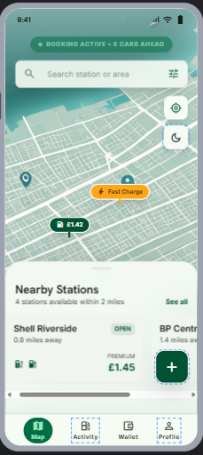

# Fuel Management System - Mobile App

A modern, feature-rich mobile application for efficient fuel management and booking. Built with React Native and Expo, this app provides users with seamless access to fuel stations, real-time booking capabilities, and location-based services.

## 📱 Overview

The Fuel Management System Mobile App is designed to revolutionize how users manage their fuel needs. With an intuitive interface and powerful features, users can easily locate fuel stations, make bookings, and manage their fuel consumption on the go.

**Key Highlights:**

- Real-time fuel station discovery
- One-tap fuel booking
- Interactive map navigation
- Secure authentication
- Dark mode support
- Cross-platform compatibility (iOS & Android)

---

## ✨ Features

### Authentication

- Secure user registration and login
- Token-based authentication
- Session persistence
- Account management

### Fuel Station Discovery

- Browse available fuel stations
- View station details and pricing
- Real-time availability status
- Station ratings and reviews

### Booking System

- Quick fuel booking interface
- Multiple payment options
- Booking history and tracking
- Booking confirmation and receipts

### Location Services

- GPS-enabled map integration
- Find nearby fuel stations
- Distance calculation
- Route navigation

### User Experience

- Dark mode / Light mode toggle
- Responsive design for all screen sizes
- Smooth animations and transitions
- Offline capability (cached data)

---

## 📸 Screenshots

> Screenshots will be added here as the app development progresses.
### Login and signup Screen


### map screen



### Authentication Screens

- Login Screen
- Registration Screen
- Password Recovery

### Main Dashboard

- Home Screen with featured stations
- Booking Overview

### Fuel Station Discovery

- Station List View
- Station Detail Screen
- Map View with Filters

### Booking & History

- New Booking Form
- Booking Confirmation
- Booking History

### Settings & Profile

- User Profile Screen
- Settings & Preferences
- App Settings

---

## 🛠️ Tech Stack

### Frontend

- **React Native** - Cross-platform mobile development
- **Expo** - Development framework and build service
- **TypeScript** - Type-safe development
- **NativeWind** - Tailwind CSS for React Native
- **Zustand** - State management
- **Axios** - HTTP client

### Backend Integration

- RESTful API communication
- JWT Authentication
- Real-time data updates

---

## 📋 Project Structure

```
fuel-mobile/
├── app/                           # App routing and navigation
│   ├── _layout.tsx               # Root layout
│   ├── index.tsx                 # Home screen
│   └── navigation/               # Navigation configuration
├── components/                   # Reusable UI components
├── screens/                      # Feature-specific screens
│   ├── auth/                     # Authentication screens
│   ├── booking/                  # Booking screens
│   └── map/                      # Map and location screens
├── services/                     # API service layer
│   ├── api.ts                    # API configuration
│   ├── auth.service.ts           # Authentication service
│   ├── booking.service.ts        # Booking service
│   └── station.service.ts        # Station service
├── stores/                       # Zustand stores
│   ├── authStore.ts              # Auth state
│   ├── bookingStore.ts           # Booking state
│   └── locationStore.ts          # Location state
├── types/                        # TypeScript type definitions
├── utils/                        # Utility functions
├── hooks/                        # Custom React hooks
├── constants/                    # App constants and theme
└── assets/                       # Images and static assets
```

---

## 🚀 Getting Started

### Prerequisites

- Node.js (v18 or higher)
- npm or yarn
- Expo CLI
- Mobile device or emulator (iOS Simulator or Android Emulator)

### Installation

1. **Clone the repository**

   ```bash
   cd fuel-mobile
   ```

2. **Install dependencies**

   ```bash
   npm install
   # or
   yarn install
   ```

3. **Set up environment variables**
   Create a `.env` file in the root directory:

   ```
   EXPO_PUBLIC_API_URL=http://your-backend-url
   EXPO_PUBLIC_API_TIMEOUT=30000
   ```

4. **Start the development server**

   ```bash
   npm start
   # or
   yarn start
   ```

5. **Run on your device**
   - **iOS**: Press `i` to open iOS Simulator
   - **Android**: Press `a` to open Android Emulator
   - **Mobile Device**: Scan the QR code with Expo Go app

---

## 🔧 Available Scripts

```bash
# Start development server
npm start

# Run on iOS Simulator
npm run ios

# Run on Android Emulator
npm run android

# Build for production (iOS)
npm run build:ios

# Build for production (Android)
npm run build:android

# Lint code
npm run lint

# Format code
npm run format
```

---

## 🔐 Authentication

The app uses JWT (JSON Web Token) authentication. Tokens are securely stored locally and automatically included in API requests.

**Login Flow:**

1. User enters credentials
2. Backend validates and returns JWT token
3. Token stored in secure storage
4. Automatic token refresh on expiry

---

## 📡 API Integration

All API calls are centralized in the `services/` directory:

- **Authentication**: Register, Login, Logout, Refresh Token
- **Stations**: Browse stations, Get station details, Search
- **Bookings**: Create booking, Get history, Cancel booking
- **Locations**: Get user location, Calculate distances

### API Base URL

API endpoints are configured via environment variables. Update `EXPO_PUBLIC_API_URL` to your backend server.

---

## 🎨 Theming

The app supports light and dark modes. Theme colors are defined in `constants/theme.ts` and can be easily customized.

**Theme Toggle:**

- Use the theme toggle in settings
- Preference is saved locally
- Respects system settings on first install

---

## 📦 State Management

State is managed using **Zustand**:

- **authStore**: Authentication state and user data
- **bookingStore**: Booking history and current booking
- **locationStore**: User location and map state

---

## 🤝 Contributing

We welcome contributions! Please follow these guidelines:

1. Fork the repository
2. Create a feature branch (`git checkout -b feature/amazing-feature`)
3. Commit your changes (`git commit -m 'Add amazing feature'`)
4. Push to the branch (`git push origin feature/amazing-feature`)
5. Open a Pull Request

### Code Standards

- Follow TypeScript best practices
- Use meaningful variable and function names
- Add comments for complex logic
- Test your changes before submitting

---

## 🐛 Troubleshooting

### Common Issues

**Issue: Metro server won't start**

```bash
# Clear cache and restart
npm start -- --clear
```

**Issue: Module not found**

```bash
# Reinstall dependencies
rm -rf node_modules
npm install
```

**Issue: Build fails**

```bash
# Clear Expo cache
expo start -c
```

---

## 📝 License

This project is licensed under the MIT License - see the LICENSE file for details.

---

## 📞 Support

For support, email support@fuelmanagementsystem.com or open an issue on the project repository.

---

## 🎯 Roadmap

- [ ] Push notifications for booking updates
- [ ] Payment gateway integration
- [ ] Advanced analytics and reporting
- [ ] Multi-language support
- [ ] Offline mode enhancements
- [ ] Social sharing features
- [ ] Loyalty program integration

---

## 👥 Team

Built with ❤️ by the Fuel Management System Team

---

**Last Updated**: May 2026
